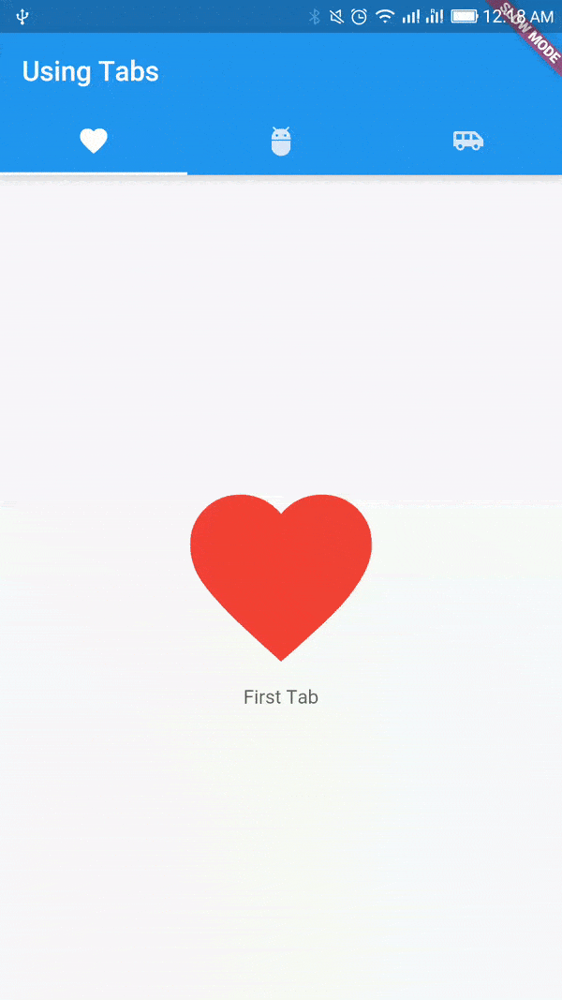

# FlutterUTNjulio2021
_Curso de Flutter dev UTN Extension Universitaria y Post Grado

## Empezando
Este proyecto es un punto de partida para una aplicación Flutter.

Algunos recursos para comenzar si este es su primer proyecto de Flutter:

Laboratorios y documentaciones oficiales de utilidad
https://flutter.dev/docs/cookbook
https://flutter.dev/docs

## Clase2 :
*Investigar Colleciones de Datos https://api.dart.dev/stable/2.13.4/dart-collection/SplayTreeSet-class.html
## Clase3 :
* **Realizar Ejercitacion de Sintaxis Dart ** - *Documentación* - https://github.com/alexdeassis7/FlutterUTNjulio2021/tree/main/EjecitacionPracticaDart
## Clase4 :
Configuracion de Enviroment Dev

### Herramientas a Instalar 🔧:
*SDK FLutter + VAriable de entorno en el PATH (FLUTTER_HOME : C:\flutter_windows_2.2.3-stable\flutter\bin) - dejar si o si la ruta asi fuera de Programs Files 

*VSCode + Extensiones Flutter y Dart 

*AndroidStudio + SDK + Emulador + Plugin Flutter y Dart

Emulador Genymotion (sin VirtualBox) crear credenciales para poder utilizarlo + Virtual Box :https://www.genymotion.com/download/ , https://www.virtualbox.org/wiki/Downloads

### Atajos Utilies VSCode Flutter

Ctrl + alt + d => inicia el Dev Tools

### Comandos Utilies CLI Flutter

*flutter doctor --verbose (chequeamos si tenems todo lo necesario para desarrollar) , agregar la url que nos figura en la consola de VSCode
por ejemplo : An Observatory debugger and profiler on sdk gphone x86 is available at: http://127.0.0.1:60535/YtuxI3ErmAo=/

*flutter config --android-studio-dir="C:\Program Files\Android\Android Studio" (si tenemos algo mal al ejecutar comando flutter doctor ,por ejemplo si no detecta la instalacion de                 android podemos solucionarlo)

*flutter packages 

*flutter analyze

*flutter test 

flutter run (para ejecutar nuestra app)

### Links de Utilidad

*Como utilizar Dev Tools Flutter/ Dart https://flutter.dev/docs/development/tools/devtools

*como crear una app y comando Utiles del CLI flutter https://flutter.dev/docs/reference/flutter-cli

*pubspec.yaml => Gestion de paquetes y uso de versiones : https://flutter.dev/docs/development/packages-and-plugins/using-packages

*Problemas para instalar paquetes ?  https://stackoverflow.com/questions/55771635/flutter-packages-get-does-not-install-new-package

*Flutter web -  https://medium.com/comunidad-flutter/flutter-para-la-web-91d8b217ad35

*Plus -extras WEb + mobile deploy-  https://medium.com/flutter-community/programming-on-your-phone-a2547f0e293

* archivos y carpetas de un proyecto fluterr : https://medium.com/codingthesmartway-com-blog/getting-started-with-flutter-2-project-structure-8066bde05270

*Layout leer siguiente tutorial https://esflutter.dev/docs/development/ui/layout

### Tarea Clase 5 
Tarea : ver siguientes links https://flutter.dev/docs/development/tools/devtools ,https://blog.pleets.org/article/widgets-en-flutter, y https://esflutter.dev/docs/development/ui/layout

Realizar ejercicio1 StateFull e intentar crear una "galeria de imagenes"

### Clase 6

Leer los Siguientes Link : 
https://blog.pleets.org/article/filas-y-columnas-en-flutter
https://medium.com/gdg-ipn/layouts-en-flutter-filas-y-columnas-58a935caaeab

### Clase 7 
#### Demo login 
#### Consumo de api rest 
#### Tarea 1 del proyecto "Consumiendo_rest_api" generar un layout para que se vean todo los nombre de los personajes de Start wars , imvestigar widgets
ListView.builder() o utilizar el que les resulte mas amigable  ,

#### Tarea 2 crear un proyecto que consuma algun end point de la siguiente API REST https://rickandmortyapi.com/ una vez obtenido los datos mostrarlos por consola y el en layout de la app

### Clase 8 
Colabora Hector: Les paso un par de cosas que encontré y me parecieron interesantes:
https://github.com/lohanidamodar/flutter_ui_challenges
https://blog.logrocket.com/best-practices-laying-out-flutter-app/

Ejercitacion Tarea :
#### 1)Leer y Realizar el siguiente tutorial para practicar conceptos de diseños basicos en flutter => https://flutter.dev/docs/codelabs/layout-basics
#### 2)en el Ejercicio WhatsUpp deberan parametrizar la clase "ChatItem" creando los atributos necesarios y un constructor que penmitar modificar los atributos de la clase 
    Ejemplo constructor  : ChatItem(urlImagen, mensajeRecibido , numeroDeCelularDeEmisorDeMensaje , hroaDeUltimoMensajeRecibido , cantidadDeMensajesSinLeer);
    
## Centrado en Columnas y Filas (Column & Row)
### En una columna :
para centrar (o alinear) verticalmente , se utiliza mainAxisAlignment .
para centrar (o alinear) horizontalmente , se utiliza crossAxisAlignment .
### En una fila :
para centrar (o alinear) horizontalmente , se utiliza mainAxisAlignment .
para centrar (o alinear) verticalmente , se utiliza crossAxisAlignment .

### temas alumnos
Rest consumer Service - Bloc Patron - Stream Builder - Circular progress Indicator (animaciones asincronicas)

### PARA EXPANDIAR O CONTRAER EL TAMAÑO DE NUESTRO EMULADOR :
NOS POSICIONAMOS POR sobre la pantalla con los dos dedos del pad y con las flechas arriba y abajo cambiamos su tamaño
### PARA PONERLO VERTICAL U HORIZONTAL AL EMULADOR :
NOS POSICIONAMOS POR sobre la pantalla con los dos dedos del pad y con las flechas IZQUIERDA Y DERECHA LO giramos

### para aquel que esta familiarizado con CSS ver este link 
https://esflutter.dev/docs/get-started/flutter-for/web-devs

## para formatear un json a clase dart usar este link  : https://javiercbk.github.io/json_to_dart/

Main repository containing all the example apps demonstrating features/functionality/integrations in [Flutter](https://flutter.io/) application development

### Featured In

- [Official Flutter Samples](https://github.com/flutter/samples/blob/d500d15c0f098b56e5bd549b32485cedba4843ef/INDEX.md#flutter-examples--)
- [Flutter Weekly #11](https://mailchi.mp/5db146a7468b/flutter-weekly-11)
- [Awesome Flutter](https://github.com/Solido/awesome-flutter#demonstrations)

Lookup Links: [[Setup Flutter](https://flutter.io/setup/)] [[Widgets Catalog](https://flutter.io/widgets/)] [[Dart Lang](https://flutter.io/bootstrap-into-dart/)]

## Example apps

 

1. [Simple Material App](/simple_material_app)
1. [Using Theme](/using_theme)
1. [Stateless Widgets](/stateless_widgets)
1. [Stateful Widget](/stateful_widget)
1. [Using EditText](/using_edittext)
1. [Load local image](/load_local_image)
1. [Load local json](/load_local_json)
1. [Unit Testing](/unit_testing)
1. [Using HTTP GET](/using_http_get)
1. [Using Alert Dialog](/using_alert_dialog)
1. [Using Stepper](/using_stepper)
1. [Using Tabs](/using_tabs)
1. [Using Bottom Navigation Bar](/using_bottom_nav_bar)
1. [Using Custom Fonts](/using_custom_fonts)
1. [Using Gradient](/using_gradient)
1. [Navigation Drawer](/navigation_drawer)
1. [Enable Splash Screen](/enabling_splash_screen)
1. [Using Listview](/using_listview)
1. [Using SnackBar](/using_snackbar)
1. [Grid Layout](/grid_layout)
1. [DropDown Button](/dropdown_button)
1. [Image from Network](/image_from_network)
1. [Infinite List](/infinite_list)
1. [Google Signin](/google_signin)
1. [Persist Key Value](/persist_key_value)
1. [Using InteractiveViewer](/using_interactiveviewer)
1. [Using Bottom Sheet](/bottom_sheet)
1. [View PDF File](/view_pdf_file)

### Complete apps with multiple features

1. [Tip Calculator](/tip_calculator)
1. [Expense Planner](/expense_planner)
1. [Notes App](/using_firebase_db)
